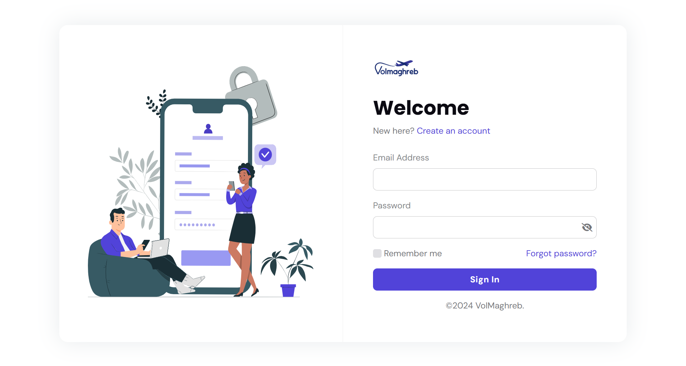
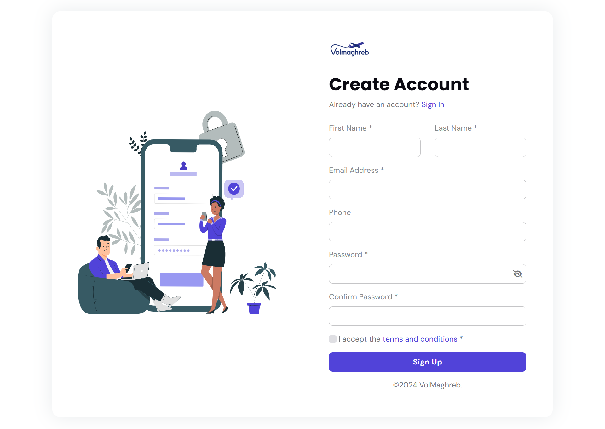
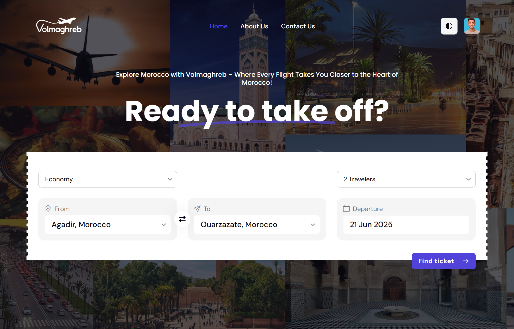
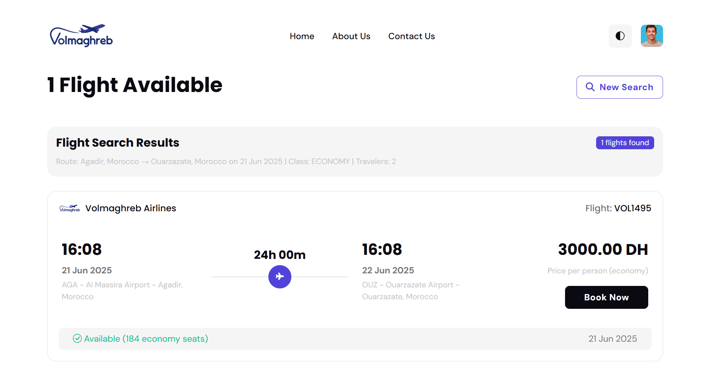
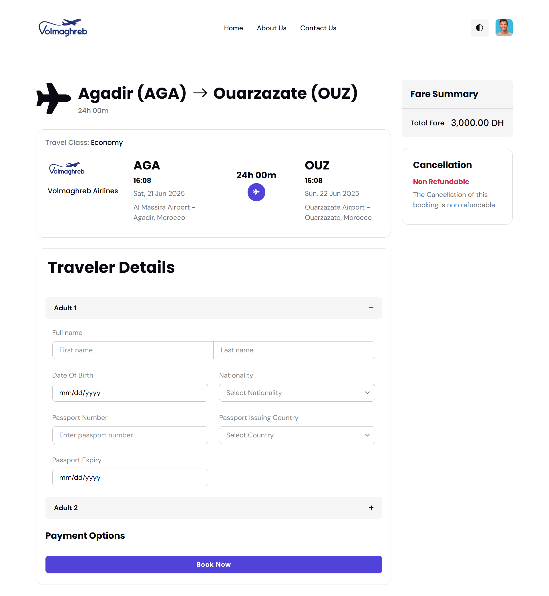
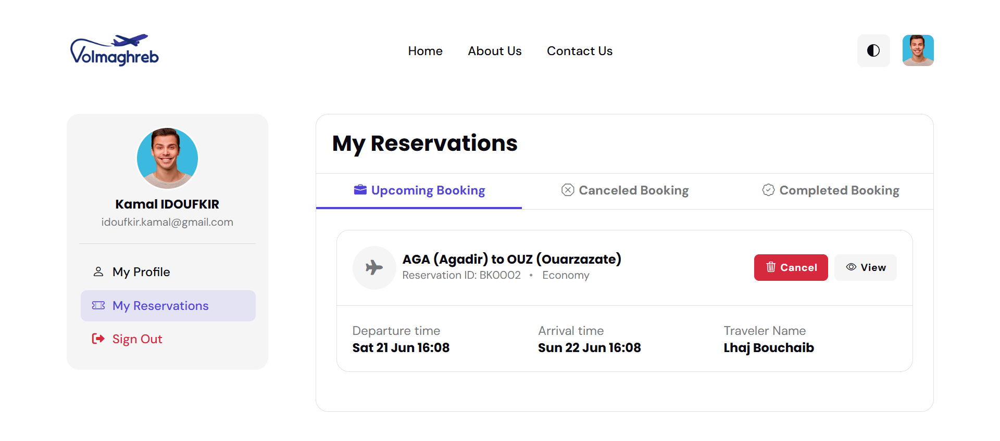
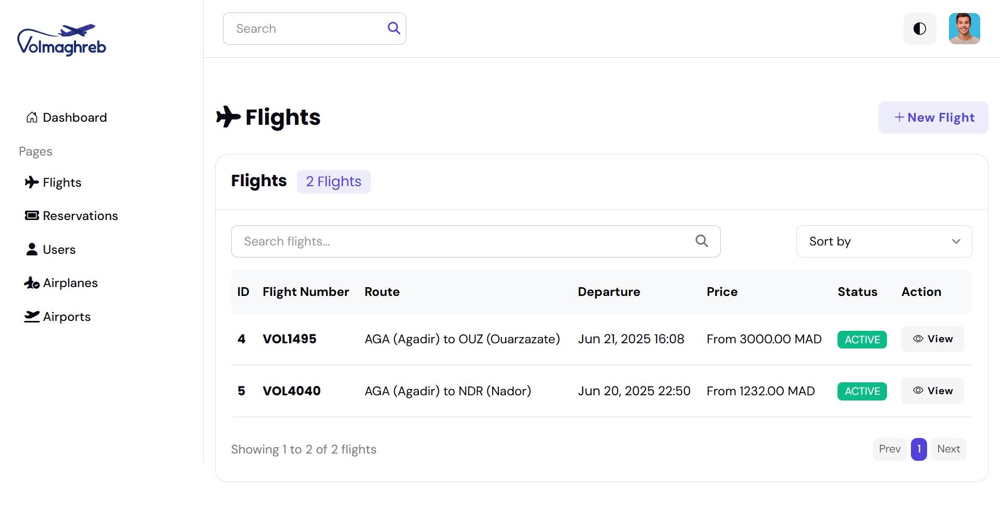
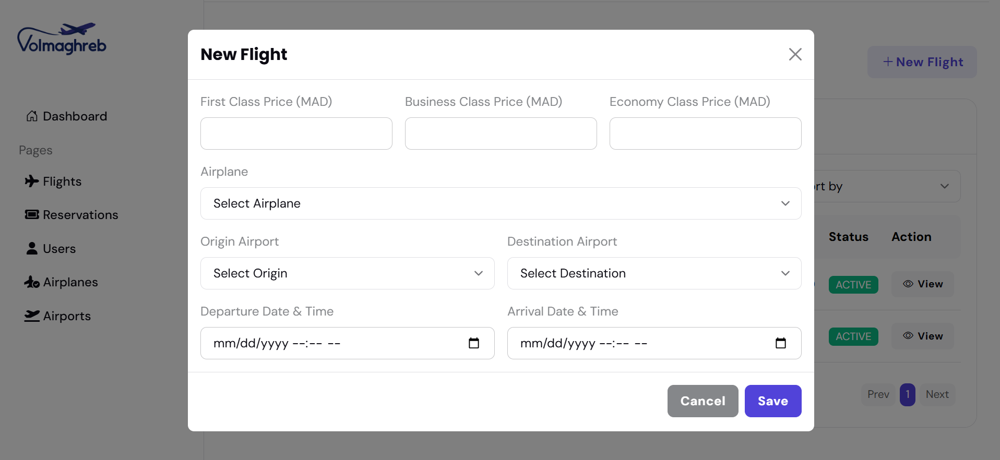
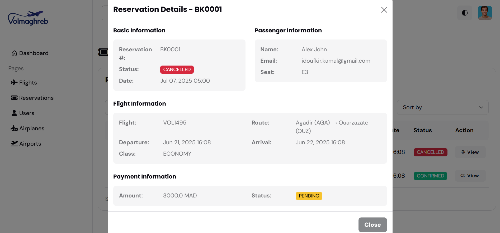
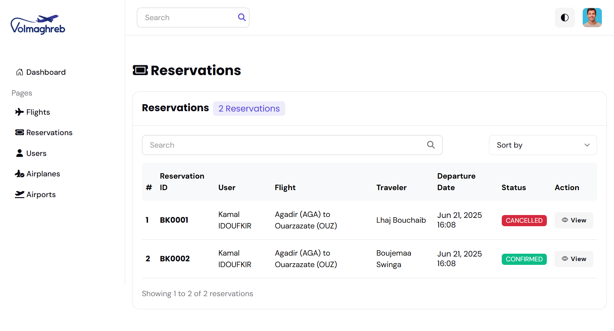

# VolMaghreb Flight Reservation System

VolMaghreb is a reliable and user-friendly flight reservation platform built with Spring Boot and modern web technologies. It features a clean, modern design and enables efficient management of flight bookings and airline operations for both customers and administrators.

## 🚀 Features

### For Customers
- **Flight Search**: Search flights by origin, destination, date, and travel class
- **Flight Booking**: Book flights with multiple travelers
- **Reservation Management**: View and manage personal reservations
- **User Authentication**: Secure user registration and login
- **Profile Management**: Update personal information and passwords

### For Administrators
- **Dashboard**: Overview of system statistics and metrics
- **Flight Management**: Create, update, and delete flights
- **Airport Management**: Manage airport information
- **Airplane Management**: Manage aircraft fleet
- **User Management**: View and manage user accounts
- **Reservation Oversight**: Monitor all reservations in the system

## 📸 Images of the Website

### Customer Interface

<table>
  <tr>
    <td align="center">
      
      <br><b>Login Page</b>
    </td>
    <td align="center">
      
      <br><b>Sign up Page</b>
    </td>
  </tr>
  <tr>
    <td align="center">
      
      <br><b>Flight Search</b>
    </td>
    <td align="center">
      
      <br><b>Flight Results</b>
    </td>
  </tr>
  <tr>
    <td align="center">
      
      <br><b>Flight Booking</b>
    </td>
    <td align="center">
      
      <br><b>My Reservations Page</b>
    </td>
  </tr>
</table>

### Admin Interface

<table>
  <tr>
    <td align="center">
      
      <br><b>Admin Dashboard</b>
    </td>
    <td align="center">
      
      <br><b>Flight Management</b>
    </td>
  </tr>
  <tr>
    <td align="center">
      
      <br><b>Add New Flight</b>
    </td>
    <td align="center">
      
      <br><b>Flight Details</b>
    </td>
  </tr>
  <tr>
    <td align="center">
      
      <br><b>Edit Flight</b>
    </td>
    <td align="center">
      
      <br><b>Reservation Management</b>
    </td>
  </tr>
  <tr>
    <td align="center">
      
      <br><b>Reservation Details</b>
    </td>
  </tr>
</table>

## �🛠️ Technology Stack

- **Backend**: Spring Boot 3.2.0, Java 17
- **Frontend**: Thymeleaf, Bootstrap 5.3.2, jQuery 3.7.1
- **Database**: MySQL 8.0
- **Security**: Spring Security 6
- **Build Tool**: Maven
- **Additional**: Lombok, Apache Commons Lang3

## 📋 Prerequisites

- Java 17 or higher
- MySQL 8.0 or higher
- Maven 3.6 or higher

## ⚙️ Installation & Setup

### 1. Clone the Repository
```bash
git clone <repository-url>
cd volmaghreb
```

### 2. Database Setup
Create a MySQL database:
```sql
CREATE DATABASE volmaghreb_db;
```

### 3. Environment Configuration
Create a `.env` file in the root directory:
```env
DB_USERNAME=your_mysql_username
DB_PASSWORD=your_mysql_password
```

Alternatively, copy and configure the application properties:
```bash
cp src/main/resources/application.properties.example src/main/resources/application.properties
```

Update the database credentials in `application.properties`:
```properties
spring.datasource.url=jdbc:mysql://localhost:3306/volmaghreb_db?createDatabaseIfNotExist=true&useSSL=false&serverTimezone=UTC&allowPublicKeyRetrieval=true
spring.datasource.username=${DB_USERNAME}
spring.datasource.password=${DB_PASSWORD}
```

### 4. Build and Run
```bash
mvn clean install
mvn spring-boot:run
```

The application will be available at: `http://localhost:8080/volmaghreb`

## 🔐 Default Credentials

### Admin Account
- **Email**: admin@volmaghreb.com
- **Password**: admin123

*Note: The admin account is automatically created on first startup.*

## 📁 Project Structure

```
src/
├── main/
│   ├── java/com/volmaghreb/reservation/
│   │   ├── controllers/          # Web and REST controllers
│   │   ├── services/             # Business logic layer
│   │   ├── repositories/         # Data access layer
│   │   ├── entities/             # JPA entities
│   │   ├── dtos/                 # Data transfer objects
│   │   ├── enums/                # Enumeration classes
│   │   ├── mappers/              # Entity-DTO mappers
│   │   └── config/               # Configuration classes
│   ├── resources/
│   │   ├── templates/            # Thymeleaf templates
│   │   ├── static/               # Static web assets
│   │   └── application.properties
```

## 🔧 Configuration

### Server Configuration
```properties
server.port=8080
server.servlet.context-path=/volmaghreb
```

### Database Configuration
```properties
spring.jpa.hibernate.ddl-auto=update
spring.jpa.show-sql=true
spring.jpa.properties.hibernate.dialect=org.hibernate.dialect.MySQL8Dialect
```

### Security Configuration
- Form-based authentication
- Role-based access control (ADMIN, CLIENT)
- Session management with remember-me functionality

## 🎨 UI/UX Features

- **Responsive Design**: Bootstrap-based responsive layout
- **Modern Interface**: Clean and professional design
- **Interactive Elements**: Dynamic form validation and feedback
- **Search Functionality**: Advanced flight search with filters
- **User Dashboard**: Personalized user experience
- **Modal-Based Management**: Popup windows for all CRUD operations, keeping management functions on a single page for seamless workflow


---

**VolMaghreb Flight Reservation System**